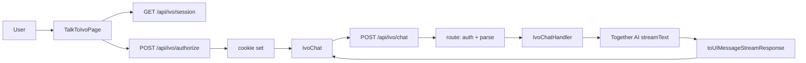

# ivanarrizabalaga.com

Personal site for Iván Arrizabalaga Getino: portfolio, writing, experience, skills, and contact. Includes **Talk to Ivo** — an invite-gated AI chat that acts as his digital twin for professional conversations, job interviews, and technical deep-dives.

## Stack

- **Next.js 16** (App Router)
- **React 19**
- **next-intl** — i18n (English, Spanish)
- **Tailwind CSS 4**
- **Vercel AI SDK** + **Together AI** — streaming chat for Ivo
- **next-themes** — light/dark mode
- **Radix UI** — accessible components (dropdowns, tabs)
- **Framer Motion** — animations
- **react-markdown** — assistant message rendering

## Getting started

**Prerequisites:** Node 20+

```bash
git clone <repo-url>
cd ivanarrizabalaga.com
npm install
npm run dev
```

Open [http://localhost:3000](http://localhost:3000). Optional: run `npm run download-covers` if you need writing post covers locally.

## Environment variables

Use `.env.local` for local development. The site runs without these, but **Talk to Ivo** will return 503 or prompt for an invite until configured.

| Variable | Required for Ivo | Description |
|----------|------------------|-------------|
| `TOGETHERAI_API_KEY` | Yes | Together AI API key for the chat model |
| `IVO_INVITE_CODE` | Yes | Invite code users must enter to access the chat |
| `IVO_MODEL_NAME` | No | Model ID (default: `moonshotai/Kimi-K2.5`) |
| `LOG_LEVEL` | No | Log verbosity |
| `NEXT_PUBLIC_SITE_URL` | No | Canonical site URL (e.g. for metadata) |

## High-level architecture: Ivo

Ivo is an invite-gated chat: users enter a code, receive an HTTP-only cookie, then can send messages. The backend builds a system prompt (persona + rules) plus Iván’s resume JSON as context, streams replies via the Vercel AI SDK and Together AI, and returns a stream to the client.

**Key files:**

- [app/api/ivo/chat/route.ts](app/api/ivo/chat/route.ts) — Auth, API key, message parsing; delegates to handler
- [app/api/ivo/chat/ivo-chat-handler.ts](app/api/ivo/chat/ivo-chat-handler.ts) — System prompt + resume, `streamText` (Together AI), stream response
- [lib/ai/ivo-system-prompt.ts](lib/ai/ivo-system-prompt.ts) — Persona, tone, and behavioral rules
- [app/[locale]/talk-to-ivo/IvoChat.tsx](app/[locale]/talk-to-ivo/IvoChat.tsx) — `useChat` UI and markdown rendering

**Request flow:**



## Project structure

| Path | Purpose |
|------|---------|
| `app/[locale]/` | Locale-aware pages: home, experience, skills, writing, contact, talk-to-ivo |
| `app/api/ivo/` | Ivo API: authorize, session, chat |
| `lib/` | AI helpers, chat message parsing, shared utilities |
| `messages/` | next-intl translations (en, es) |
| `data/` | Resume JSON and static data |

## Scripts

| Command | Description |
|---------|-------------|
| `npm run dev` | Start dev server |
| `npm run build` | Production build |
| `npm run start` | Start production server |
| `npm run lint` | Run ESLint |
| `npm run download-covers` | Fetch writing post cover images |

## Deploy

Designed for [Vercel](https://vercel.com). Set the environment variables above in the project dashboard.
